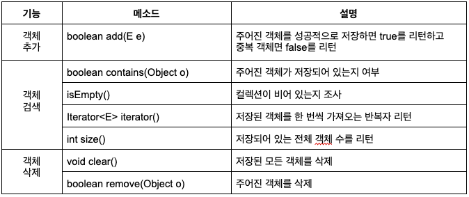
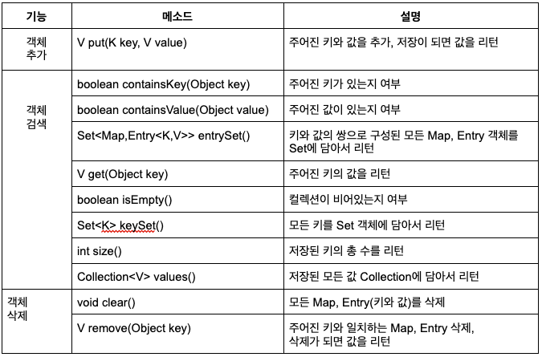

## 컬렉션 자료구조

---

### 컬렉션 프레임워크


### List 컬렉션


#### ArrayList
```java
    List<E> list = new ArrayList<E>();  //E에 지정된 타입의 객체만 저장
    List<E> list = new ArrayList<>();   //E에 지정된 타입의 객체만 저장
    List list = new ArrayList<>();  //모든 타입의 객체를 저장
```

```java
package ch15.sec02.exam01;

public class Board {
    private String subject;
    private String content;
    private String writer;

    public Board(String subject, String content, String writer){
        this.subject = subject;
        this.content = content;
        this.writer = writer;
    }

    public String getSubject() {return subject;}
    public void setSubject(String subject) {this.subject = subject; }
    public String getContent() {return content;}
    public void setContent(String content) {this.content = content;}
    public String getWriter() {return writer;}
    public void setWriter(String writer) {this.writer = writer;}
}
```

```java
package ch15.sec02.exam01;

import java.util.*;

public class ArrayListExample {
    public static void main(String[] args) {
        //ArrayList 컬렉션 생성
        List<Board> list = new ArrayList<>();

        //객체 추가
        list.add(new Board("제목1", "내용1", "글쓴이1"));
        list.add(new Board("제목2", "내용2", "글쓴이2"));
        list.add(new Board("제목3", "내용3", "글쓴이3"));
        list.add(new Board("제목4", "내용4", "글쓴이4"));
        list.add(new Board("제목5", "내용5", "글쓴이5"));

        //저장된 총 객체 수 얻기
        int size = list.size();
        System.out.println("총 객체 수: "+size);
        System.out.println();

        Board board = list.get(2);
        System.out.println(board.getSubject()+"\t"+board.getContent()+"\t"+board.getWriter());
        System.out.println();

        //모든 객체를 하나씩 가져오기
        for(int i=0; i<list.size(); i++){
            Board b = list.get(i);
            System.out.println(b.getSubject()+"\t"+b.getContent()+"\t"+b.getWriter());
        }
        System.out.println();

        //객체 삭제
        list.remove(2);
        list.remove(2);

        //향상된 for 문으로 모든 객체를 하나씩 가져오기
        for(Board b : list){
            System.out.println(b.getSubject()+"\t"+b.getContent()+"\t"+b.getWriter());
        }
    }
}
```

#### Vector
Vector는 ArrayList와 동일한 내부 구조를 가지고 있다. 차이점은 Vector는 동기화된 메소드로 구성되어 있기 때문에 멀티 스레드가 동시에
Vector() 메소드를 실행할 수 없다는 것이다.
```java
    List<E> list = new Vector<E>();     //E에 지정된 타입의 객체만 저장 
    List<E> list = new Vector<>();      //E에 지정된 타입의 객체만 저장
    List list = new Vector();           //모든 타입의 객체를 저장
```

#### LinkedList
LinkedList는 ArrayList와 사용 방법은 동일하지만 내부 구조는 완전히 다르다. 
ArrayList는 내부 배열에 객체를 저장하지만, LinkedList는 인접 객체를 체인처럼 연결해서 관리한다.
<br>
LinkedList는 특정 위치에서 객체를 삽입하거나 삭제하면 바로 앞뒤 링크만 변경하면 되므로 빈번한 객체 삭제와 삽입이
일어나는 곳에서는 ArrayList보다 좋은 성능을 발휘한다.

```java
    List<E> list = new LinkedList<E>();     //E에 지정된 타입의 객체만 저장 
    List<E> list = new LinkedList<>();      //E에 지정된 타입의 객체만 저장
    List list = new LinkedList();           //모든 타입의 객체를 저장
```

### Set 컬렉션


#### HashSet
```java
    Set<E> set = new HashSet<E>();      //E에 지정된 타입의 객체만 저장
    Set<E> set = new HaseSet<>();       //E에 지정된 타입의 객체만 저장
    Set set = new HashSet();            //모든 타입의 객체를 저장
```
```java
package ch15.sec03.exam01;

import java.util.*;

public class HashSetExample {
    public static void main(String[] args) {
        //HashSet 컬렉션 생성
        Set<String> set = new HashSet<String>();

        //객체 저장
        set.add("Java");
        set.add("JDBC");
        set.add("JSP");
        set.add("Java");    // 중복 객체이므로 저장하지 않음
        set.add("Spring");

        //저장된 객체 수 출력
        int size = set.size();
        System.out.println("총 객체 수 : "+size);

    }
}
```
Set 컬렉션은 인덱스로 객체를 검색해서 가져오는 메소드가 없다. 대신 객체를 한 개씩 반복해서 가져와야 하는데, 
여기에는 두 가지 방법이 있다. 하나는 다음과 같이 for 문을 이용하는 것이다.
```java
    Set<E> set = new HashSet<>();
    for(E e : set){
        ...
    }
```
다른 방법은 다음과 같이 Set 컬렉션의 iterator() 메소드로 반복자를 얻어 객체를 하나씩 가져오는 것이다.
```java
    Set<E> set = new HashSet<>();
    Iterator<E> iterator = set.iterator();
```

iterator는 Set 컬렉션의 객체를 가져오거나 제거하기 위해 다음 메소드를 제공한다.

| 리턴 타입   | 메소드명    | 설명                                              |
|----------|-----------|-------------------------------------------------|
| boolean  | hasNext() | 가져올 객체가 있으면 true를 리턴하고 없으면 false를 리턴한다. |
| E        | next()    | 컬렉션에서 하나의 객체를 가져온다.                       |
| void     | remove()  | next()로 가져온 객체를 Set 컬렉션에서 제거한다.           |

```java
    while(iterator.hasNext()){
        E e = interator.next();
    }   
```

hasNext() 메소드로 가져올 객체가 있는지 먼저 확인하고, true를 리턴할 때만 next() 메소드로 객체를 가져온다.
 만약 next()로 가져온 객체를 컬렉션에서 제거하고 싶다면 remove() 메소드를 사용한다.

```java
package ch15.sec03.exam03;

import java.util.*;

public class HashSetExample {
 public static void main(String[] args) {
  //HashSet 컬렉션 생성
  Set<String> set = new HashSet<String>();

  //객체 추가
  set.add("Java");
  set.add("JDBC");
  set.add("JSP");
  set.add("Spring");

  //객체를 하나식 가져와서 처리
  Iterator<String> iterator = set.iterator();
  while(iterator.hasNext()){
   //객체를 하나 가져오기
   String element = iterator.next();
   System.out.println(element);
   if(element.equals("JSP")){
    //가져온 객체를 컬렉션에서 제거
    iterator.remove();
   }
  }
  System.out.println();

  //객체 제거
  set.remove("JDBC");

  //객체를 하나씩 가져와서 처리
  for(String element : set){
   System.out.println(element);
  }
 }
}
```

### Map 컬렉션
Map 컬렉션은 키(key)와 값(Value)으로 구성된 엔트리 객체를 저장한다. 여기서 키와 값은 모두 객체이다. 키는 중복
저장할 수 없지만 값은 중복 저장할 수 있다. 기존에 저장된 키와 동일한 키로 값을 저장하면 기존의 값은 없어지고 새로운 
값으로 대치된다.



#### HashMap
HashMap은 키로 사용할 객체가 haseCode() 메소드의 리턴값이 같고 equals() 메소드가 true를 리턴할 경우, 동일 키로 
보고 중복 저장을 허용하지 않는다.

```java
    Map<K, V> map = new HashMap<K, V>();
```

키는 String 타입, 값은 Integer 타입으로 갖는 HashMap은 다음과 같이 생성할 수 있다. Map에 지정된 키와
 값의 타입이 HashMap과 동일할 경우, HashMap<>을 사용할 수 있다.
```java
    Map<String, Integer> map = new HashMap<String, Integer>();
    Map<String, Integer> map = new HashMap<>();
```

```java
package ch15.sec04.exam01;

import java.util.*;

public class HashMapExample {
 public static void main(String[] args) {
  //Map 컬렉션 생성
  Map<String, Integer> map = new HashMap<>();

  //객체 저장
  map.put("신용권", 85);
  map.put("홍길동", 90);
  map.put("동장군", 80);
  map.put("홍길동", 95); // 키가 같기 때문에 제일 마지막에 저장한 값만 저장
  System.out.println("총 Entry 수 : "+map.size());
  System.out.println();

  //키로 값 얻기
  String key = "홍길동";
  int value = map.get(key);   // 키를 매개값으로 주면 값을 리턴
  System.out.println(key+": "+value);
  System.out.println();

  //키 Set 컬렉션을 얻고, 반복해서 키와 값을 얻기
  Set<String> keySet = map.keySet();
  Iterator<String> keyIterator = keySet.iterator(); // 키를 반복하기 위해 반복자를 얻음
  while(keyIterator.hasNext()){
   String k = keyIterator.next();
   Integer v = map.get(k);
   System.out.println(k+" : "+v);
  }
  System.out.println();

  //엔트리 Set 컬렉션을 얻고, 반복해서 키와 값을 얻기
  Set<Entry<String, Integer>> entrySet = map.entrySet();
  Iterator<Entry<String, Integer>> entryIterator = entrySet.iterator();
  while(entryIterator.hasNext()){
   Entry<String, Integer> entry = entryIterator.next();
   String k = entry.getKey();
   Integer v = entry.getValue();
   System.out.println(k+" : "+v);
  }
  System.out.println();

  //키로 엔트리 삭제
  map.remove("홍길동");
  System.out.println("총 Entry 수: "+map.size());
  System.out.println();
 }
}

```

#### Hashtable
Hashtable은 HashMap과 동일한 내부 구조를 가지고 있다. 차이점은 Hashtable은 동기화된(synchronized) 메소드로 
구성되어 있기 때문에 멀티 스레드가 동시에 Hashtable의 메소드들을 실행할 수 없다는 것이다. 따라서 멀티 스레드 환경에서도 
안전하게 객체를 추가, 삭제할 수 있다.

```java
    Map<String, Integer> map = new Hashtable<String, Integer>();
    Map<String, Integer> map = new Hashtable<>();
```

#### Properties
Properties는 Hashtable의 자식 클래스이기 때문에 Hashtable의 특징을 그대로 가지고 있다. Properties는 
키와 값을 String 타입으로 제한한 컬렉션이다. Properties는 주로 확장자가 .properties인 프로퍼티 파일을 읽을 때 사용한다.

### 검색 기능을 강화시킨 컬렉션
컬렉션 프레임워크는 검색 기능을 강화시킨 TreeSet과 TreeMap을 제공한다. 이름에서 알 수 있듯이 TreeSet은 Set 컬렉션이고,
 TreeMap은 Map 컬렉션이다.

#### TreeSet
TreeSet은 이진트리를 기반으로 한 Set 컬렉션이다. TreeSet에 객체를 저장하면 자동으로 정렬된다. 
부모 노드의 객체와 비교해서 낮은 것은 왼쪽 자식 노드에, 높은 것은 오른쪽 자식 노드에 저장한다.
```java
    TreeSet<E> treeSet = new TreeSet<E>();
    TreeSet<E> treeSet = new TreeSet<>();
```

| 리턴 타입             | 메소드명                                                                            | 설명                              |
|--------------------|---------------------------------------------------------------------------------|---------------------------------|
| E                  | first()                                                                         | 제일 낮은 객체를 리턴                    |
| E                  | last()                                                                          | 제일 높은 객체를 리턴                    |
| E                  | lower(E e)                                                                      | 주어진 객체보다 바로 아래 객체를 리턴 |
| E                  | higher(E e)                                                                     | 주어진 객체보다 바로 위 객체를 리턴 |
| E                  | floor(E e)                                                                      | 주어진 객체와 동등한 객체가 있으면 리턴, 만약 없다면 주어진 객체의 바로 아래의 객체를 리턴 |
| E                  | ceiling(E e)                                                                    | 주어진 객체와 동등한 객체가 있으면 리턴, 만약 없다면 주어진 객체의 바로 위의 객체를 리턴 |
| E                  | pollFirst()                                                                     | 제일 낮은 객체를 꺼내오고 컬렉션에서 제거함 |
| E                  | pollLast()                                                                      | 제일 높은 객체를 꺼내오고 컬렉션에서 제거함 |
| Iterator<E>        | descendingIterator()                                                            | 내림차순으로 정렬된 Iterator를 리턴 |
| NavigableSet<E>    | descendingSet()                                                                 | 내림차순으로 정렬된 NaigableSet을 리턴 |
| NavigableSet<E>    | headSet(E toElement, boolean inclusive)                                         | 주어진 객체보다 낮은 객체들을 NavigableSet으로 리턴, 주어진 객체 포함 여부는 두 번째 매개값에 따라 달라짐 |
| NavigableSet<E>    | tailSet(E fromElement, boolean inclusive)                                       | 주어진 객체보다 높은 객체들을 NavigableSet으로 리턴, 주어진 객체 포함 여부는 두 번째 매개값에 따라 달라짐 |
| NavigableSet<E>    | subSet(E fromElement, boolean fromInclusive, E toElement, boolean toInclusive)  | 시작과 끝으로 주어진 객체 사이의 객체들을 NavigableSet으로 리턴. 시작과 끝 객체의 포함 여부는 두 번째, 네 번째 매개값에 따라 달라짐 |

```java
package ch15.sec05.exam01;

import java.util.*;
public class TreeSetExample {
 public static void main(String[] args) {
  //TreeSet 컬렉션 생성
  TreeSet<Integer> scores = new TreeSet<>();

  //Integer 객체 저장
  scores.add(87);
  scores.add(98);
  scores.add(75);
  scores.add(95);
  scores.add(80);

  //정렬된 Integer 객체를 하나씩 가져오기
  for(Integer s : scores){
   System.out.println(s+" ");
  }
  System.out.println();

  //특정 Integer 객체를 가져오기
  System.out.println("가장 낮은 점수 : "+scores.first());
  System.out.println("가장 높은 점수 : "+scores.last());
  System.out.println("95점 아래 점수 : "+scores.lower(95));
  System.out.println("95점 위의 점수 : "+scores.higher(95));
  System.out.println("95점이거나 바로 아래 점수 : "+scores.floor(95));
  System.out.println("85점이거나 바로 위의 점수 : "+scores.ceiling(85)+"\n");

  //내림차순으로 정렬하기
  NavigableSet<Integer> descendingScores = scores.descendingSet();
  for(Integer s : descendingScores){
   System.out.print(s+" ");
  }
  System.out.println();

  //범위 검색( 80 <= )
  NavigableSet<Integer> rangeSet = scores.tailSet(80, true);

  //범위 검색( 80 <= score < 90 )
  rangeSet = scores.subSet(80, true, 90, false);
  for(Integer s : rangeSet){
   System.out.print(s+" ");
  }

 }
}

```

#### TreeMap
TreeMap은 이진 트리를 기반으로 한 Map 컬렉션이다. TreeSet과의 차이점은 키와 값이 저장된 Entry를 저장한다는 점이다.<br>
TreeMap에 엔트리를 저장하면 키를 기준으로 자동 정렬되는데, 부모 키 값과 비교해서 낮은 것은 왼쪽, 높은 것은 오른쪽 자식 노드에 Entry 객체를 저장한다.
```java
    TreeMap<K, V> treeMap = new TreeMap<K, V>();
    TreeMap<K, V> treeMap = new TreeMap<>();
```

| 리턴 타입             | 메소드명                                                                   | 설명                                                                                                    |
|-------------------|------------------------------------------------------------------------|-------------------------------------------------------------------------------------------------------|
| Map.Entry<K,V>    | firstEntry()                                                           | 제일 낮은 Map.Entry를 리턴                                                                                   |
| Map.Entry<K,V>    | lastEntry()                                                            | 제일 높은 Map.Entry를 리턴                                                                                   |
| Map.Entry<K,V>    | lowerEntry(K key)                                                      | 주어진 키보다 바로 아래 Map.Entry를 리턴                                                                           |
| Map.Entry<K,V>    | higherEntry(K key)                                                     | 주어진 키보다 바로 위 Map.Entry를 리턴                                                                            |
| Map.Entry<K,V>    | floorEntry(K key)                                                      | 주어진 키와 동등한 키가 있으면 해당 Map.Entry를 리턴, 없다면 주어진 키 바로 아래의 Map.Entry를 리턴                                    |
| Map.Entry<K,V>    | ceilingEntry(K key)                                                    | 주어진 키와 동등한 키가 있으면 해당 Map.Entry를 리턴, 없다면 주어진 키 바로 위의 Map.Entry를 리턴                                     |
| Map.Entry<K,V>    | pollFirstEntry()                                                       | 제일 낮은 Map.Entry를 꺼내오고 컬렉션에서 제거함                                                                       |
| Map.Entry<K,V>    | pollLastEntry()                                                        | 제일 높은 Map.Entry를 꺼내오고 컬렉션에서 제거함                                                                       |
| NavigableSet<K>   | descendingKeySet()                                                     | 내림차순으로 정렬된 키의 NavigableSet을 리턴                                                                        |
| NavigableMap<K,V> | descendingMap()                                                        | 내림차순으로 정렬된 Map.Entry의 NavigableMap을 리턴                                                                |
| NavigableMap<K,V> | headMap(K toKey, boolean inclusive)                                    | 주어진 키보다 낮은 Map.Entry들을 NavigableMap으로 리턴, 주어진 키의 Map.Entry 포함 여부는 두 번째 매개값에 따라 달라짐                    |
| NavigableMap<K,V> | tailMap(K fromKey, boolean inclusive)                                  | 주어진 객체보다 높은 Map.Entry들을 NavigableMap으로 리턴, 주어진 객체 포함 여부는 두 번째 매개값에 따라 달라짐                             |
| NavigableMap<K,V> | subMap(K fromKey, boolean fromInclusive, K toKey, boolean toInclusive) | 시작과 끝으로 주어진 키 사이의 Map.Entry들을 NavigableMap 컬렉션으로 반환, 시작과 끝 키의 Map.Entry 포함 여부는 두 번째, 네 번째 매개값에 따라 달라짐 |

```java
package ch15.sec05.exam02;

import java.util.*;
public class TreeMapExample {
 public static void main(String[] args) {
  //TreeMap 컬렉션 생성
  TreeMap<String,Integer> treeMap = new TreeMap<>();

  //엔트리 저장
  treeMap.put("apple", 10);
  treeMap.put("forever", 60);
  treeMap.put("description", 40);
  treeMap.put("ever", 50);
  treeMap.put("zoo", 80);
  treeMap.put("base", 20);
  treeMap.put("guess", 70);
  treeMap.put("cherry", 30);

  //정렬된 엔트리를 하나씩 가져오기
  Set<Entry<String, Integer>> entrySet = treeMap.entrySet();
  for(Entry<string, Integer> entry : entrySet){
   System.out.println(entry.getKey()+" "+entry.getValue());
  }
  System.out.println();

  //특정 키에 대한 값 가져오기
  Entry<String,Integer> entry = null;
  entry = treeMap.firstEntry();
  System.out.println("제일 앞 단어: "+entry.getKey()+"-"+entry.getValue());
  entry = treeMap.lastEntry();
  System.out.println("제일 뒤 단어: "+entry.getKey()+"-"+entry.getValue());
  entry = treeMap.lowerEntry("ever");
  System.out.println("ever 앞 단어: "+entry.getKey()+"-"+entry.getValue()+"\n");

  //내림차순으로 정렬하기
  NavigableMap<String,Integer> descendingMap = treeMap.descendingMap();
  Set<Entry<String,Integer>> descendingEntrySet = descendingMap.entrySet();
  for(Entry<String,Integer> e : descendingEntrySet){
   System.out.println(e.getKey()+"-"+e.getValue());
  }
  System.out.println();

  //범위 검색
  System.out.println("[c~h 사이의 단어 검색]");
  NavigableMap<String,Integer> rangeMap = treeMap.subMap("c", true, "h", false);
  for(Entry<String, Integer> e : rangeMap.entrySet()){
   System.out.println(e.getKey()+"-"+e.getValue());
  }
 }
}

```

* 출처: 이것이 자바다
