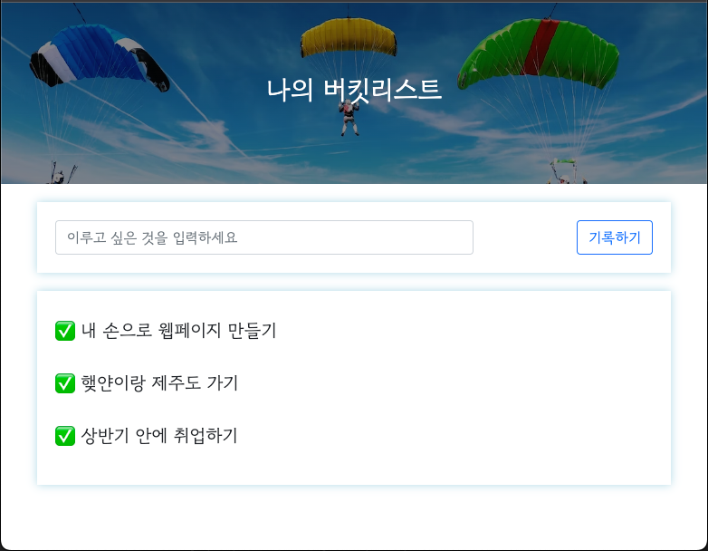
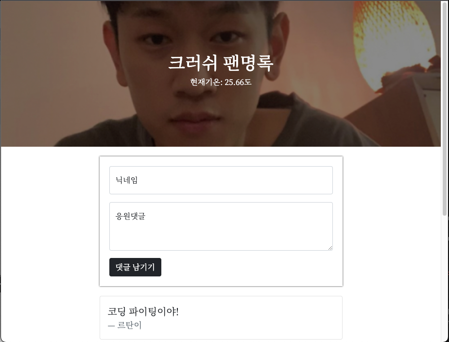
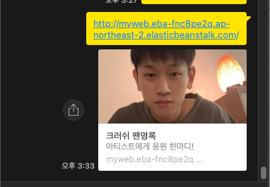

## 웹개발 종합반 4주차

---

####  나의 버킷리스트



####  팬명록
* og 태그 넣기
```html
<meta property="og:title" content="내 사이트의 제목" /> 
<meta property="og:description" content="보고 있는 페이지의 내용 요약" />
<meta property="og:image" content="이미지 URL" />
```

#### AWS Elastic Beanstalk
* AWS 클라우드에서 애플리케이션을 신속하게 배포하고 관리할 수 있는 서비스
* 애플리케이션을 업로드만 하면 용량 프로비저닝, 로드 밸런싱, 조정, 모니터링 등 자동 처리
* EB console, AWS CLI를 이용해 상호작용

### 5주차 숙제: 지금까지 만든 팬명록 도메인을 제출해주세요 :)
http://myweb.eba-fnc8pe2q.ap-northeast-2.elasticbeanstalk.com/





### 오늘 목표
1. 웹개발 종합반 5주차 복습
2. 이것이 자바다 인터페이스, 컬렉션 자료구조 공부
3. 삼성 sw 역량 테스트 기출문제 2048(Easy) 풀이

### 내일 목표
1. 알고리즘 자료구조(bfs, dfs, 백트래킹, dp, 순열, 조합) 공부하기
2. 해당 자료구조에 맞는 알고리즘 문제 풀어보기
3. 자소서 제출..